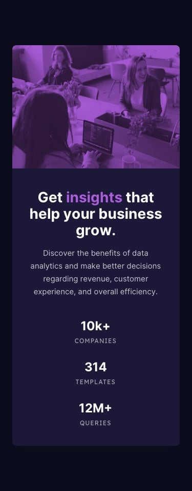

# Stats Preview Card

## Welcome! 👋

Thanks for checking out my front-end project.

I am constantly improve my HTML and CSS skills to do more projects like this.

## The Project Meaning

I wanted to show what I'm working on with, so people would know me as a real Front End designer. 
My desire is to handle more and bigger projects as this one. So, i'll appreciate any challenge suggests!

## Project Designe

I decided to build a Status Preview Card, which is a challenge from > https://www.frontendmentor.io/  
There I can have images, texts, colors used and letter fonts to work with, and they ask me to do all this design by my self, just like it's show up.

Here you can see a preview from this project seen by a desktop screen, which meens it's a 1440px plus screen width:

  

And this is a preview from a mobile screen (less than 1440px screen width):

  

## Structure of the project

>First step was transfer all the text content in an appropriate HTML syntax structure. 
>Second, separ the needed classes to aply CSS styles. 
>Thirth, putting things in place. And for that, it was necessary to know what exactly display I need for each text and image. 
>Fourth, adding some editions of the image, fonts, text sizes and other details. 
>Fifth and the last, create the responsive design for desktops screen, after the mobile screen design was already.

## Reference
* This is a challenge proposed by Front End Mentor.
* Front End Mentor only offers a sample of the expected result and the material to achieve it.
* There are no instructions or tips on how to perform the challenge, leaving any and all decisions up to the person who performs it.
